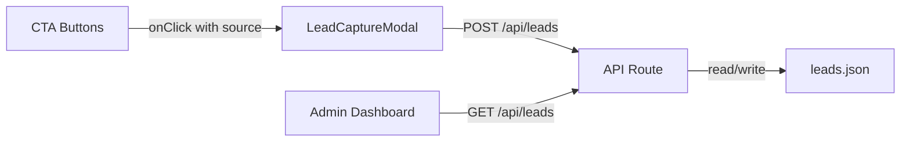

# Design Document: Lead Capture Forms

## Overview

This design adds lead capture functionality to the Trimio landing page. Every CTA button ("Start Free Trial", "Book a Demo", "Get Started", "Contact Sales") will open a modal dialog form that collects visitor contact information. Submitted leads are persisted server-side in a JSON file and viewable through an admin dashboard at `/admin/leads`.

The system consists of four main parts:
1. A reusable modal form component triggered by CTA buttons with source tracking
2. Client-side validation logic for form fields
3. A Next.js API route (`/api/leads`) for storing and retrieving leads
4. An admin dashboard page for viewing, sorting, and filtering leads



## Architecture

The feature follows Next.js App Router conventions with a clear client/server split:

- **Client components**: `LeadCaptureModal` (form + dialog), CTA button wrappers, admin dashboard page
- **Server components**: API route handler at `src/app/api/leads/route.ts`
- **Data layer**: JSON file at `data/leads.json` in the project root

### Key Design Decisions

1. **shadcn/ui Dialog for the modal**: The project already uses shadcn/ui components (Button, Card, Accordion). Adding Dialog, Input, and Label keeps the UI consistent and avoids new dependencies.

2. **React Context for modal state**: A `LeadFormProvider` context wraps the landing page and exposes an `openLeadForm(source, variant)` function. This avoids prop drilling through deeply nested components (hero, pricing, footer all need to trigger the form).

3. **JSON file storage**: Requirements specify JSON file persistence. We'll use `fs/promises` to read/write a `data/leads.json` file. A simple file-lock mechanism (write-to-temp then rename) prevents corruption from concurrent writes.

4. **Client-side validation only**: The form validates on submit before hitting the API. The API also validates required fields (name, email) and returns 400 on failure, but detailed validation messages come from the client.

5. **No authentication on admin**: Requirements don't specify auth for the admin dashboard. The `/admin/leads` route is unprotected. This is acceptable for an MVP but should be noted.

## Components and Interfaces

### LeadFormProvider (Context)

```typescript
// src/components/lead-form-provider.tsx
interface LeadFormContextValue {
  openLeadForm: (source: string, variant: 'free-trial' | 'demo') => void;
}
```

Wraps the landing page layout. Manages modal open/close state, the current `source` identifier, and the form `variant` (which determines the modal title).

### LeadCaptureModal

```typescript
// src/components/lead-capture-modal.tsx
interface LeadCaptureModalProps {
  open: boolean;
  onOpenChange: (open: boolean) => void;
  source: string;
  variant: 'free-trial' | 'demo';
}
```

Uses shadcn/ui `Dialog`, `DialogContent`, `DialogHeader`, `DialogTitle`. Contains the form fields, validation logic, submission handler, and success/error states.

Internal state machine:
- `idle` → user is filling out the form
- `submitting` → POST in flight, button disabled with spinner
- `success` → shows success message, auto-closes after 2s
- `error` → shows error message, button re-enabled

### Form Field Validation

```typescript
// src/lib/validation.ts
interface LeadFormData {
  fullName: string;
  email: string;
  phone?: string;
  company?: string;
}

interface ValidationErrors {
  fullName?: string;
  email?: string;
  phone?: string;
}

function validateLeadForm(data: LeadFormData): ValidationErrors;
```

Pure function. Returns an object with error messages for invalid fields, or an empty object if valid.

Validation rules:
- `fullName`: required, non-empty after trim
- `email`: required, must match a standard email regex
- `phone`: optional, but if provided must match a phone pattern (digits, spaces, dashes, parens, optional leading +)
- `company`: optional, no validation

### API Route

```typescript
// src/app/api/leads/route.ts

// POST body
interface CreateLeadRequest {
  fullName: string;
  email: string;
  phone?: string;
  company?: string;
  source: string;
}

// Stored record
interface Lead {
  id: string;
  fullName: string;
  email: string;
  phone: string;
  company: string;
  source: string;
  createdAt: string; // ISO 8601 UTC
}

// GET response
interface GetLeadsResponse {
  leads: Lead[];
  total: number;
}

// POST response (success)
interface CreateLeadResponse {
  lead: Lead;
}

// Error response
interface ErrorResponse {
  error: string;
}
```

- **POST**: Validates required fields, generates UUID, appends to JSON file, returns 201
- **GET**: Reads JSON file, returns all leads sorted by `createdAt` descending

### Admin Dashboard

```typescript
// src/app/admin/leads/page.tsx
```

Client component that fetches leads via `GET /api/leads` on mount. Renders a table using standard HTML `<table>` with Tailwind styling (no need for a heavy table library for this scope).

Features:
- Column sorting by clicking headers (date, name, source)
- Dropdown filter by `source`
- Empty state when no leads exist
- Total lead count display

## Data Models

### Lead Record

| Field       | Type   | Required | Description                              |
|-------------|--------|----------|------------------------------------------|
| id          | string | yes      | UUID v4, generated server-side           |
| fullName    | string | yes      | Visitor's full name                      |
| email       | string | yes      | Visitor's email address                  |
| phone       | string | no       | Phone number, stored as empty string if not provided |
| company     | string | no       | Company/salon name, stored as empty string if not provided |
| source      | string | yes      | Form source identifier (e.g., "hero-free-trial") |
| createdAt   | string | yes      | ISO 8601 UTC timestamp                   |

### JSON File Structure

```json
{
  "leads": [
    {
      "id": "550e8400-e29b-41d4-a716-446655440000",
      "fullName": "Jane Doe",
      "email": "jane@example.com",
      "phone": "+1234567890",
      "company": "Glow Salon",
      "source": "hero-free-trial",
      "createdAt": "2024-01-15T10:30:00.000Z"
    }
  ]
}
```

### Source Identifier Mapping

| CTA Location          | Button Text           | Source Identifier        |
|-----------------------|-----------------------|--------------------------|
| Hero section          | Start Free Trial      | `hero-free-trial`        |
| Hero section          | Book a Demo           | `hero-demo`              |
| Footer CTA            | Start Your Free Trial | `footer-free-trial`      |
| Footer CTA            | Book a Demo           | `footer-demo`            |
| Pricing - Starter     | Get started           | `pricing-starter`        |
| Pricing - Growth      | Get started           | `pricing-growth`         |
| Pricing - Enterprise  | Contact Sales         | `pricing-enterprise`     |


## Correctness Properties

*A property is a characteristic or behavior that should hold true across all valid executions of a system — essentially, a formal statement about what the system should do. Properties serve as the bridge between human-readable specifications and machine-verifiable correctness guarantees.*

### Property 1: Required field validation rejects missing name or email

*For any* `LeadFormData` where `fullName` is empty or whitespace-only, OR `email` is empty or whitespace-only, `validateLeadForm` should return a non-empty errors object containing the appropriate error message for each missing field.

**Validates: Requirements 2.1, 2.2**

### Property 2: Invalid email format is rejected

*For any* string that does not conform to a standard email format (missing `@`, missing domain, etc.), `validateLeadForm` should return an error with the message "Please enter a valid email address".

**Validates: Requirements 2.3**

### Property 3: Invalid phone format is rejected

*For any* non-empty string that does not match the accepted phone pattern (digits, spaces, dashes, parentheses, optional leading `+`), `validateLeadForm` should return an error with the message "Please enter a valid phone number".

**Validates: Requirements 2.4**

### Property 4: Valid form data passes validation

*For any* `LeadFormData` with a non-empty trimmed `fullName`, a correctly formatted `email`, and either no phone or a validly formatted phone, `validateLeadForm` should return an empty errors object.

**Validates: Requirements 2.1, 2.2, 2.3, 2.4, 2.5**

### Property 5: Lead storage round-trip

*For any* valid lead data (non-empty name, valid email, optional phone, optional company, and a source string), POSTing it to `/api/leads` and then GETting from `/api/leads` should return a leads array containing a record with the same `fullName`, `email`, `phone`, `company`, and `source` values, plus a generated `id` and `createdAt` timestamp.

**Validates: Requirements 3.1, 4.1, 4.4**

### Property 6: API rejects requests with missing required fields

*For any* POST request body where `fullName` or `email` is missing or empty, the `/api/leads` endpoint should return a 400 status code with an error message.

**Validates: Requirements 4.2**

### Property 7: Leads are returned sorted by date descending

*For any* set of stored leads, a GET request to `/api/leads` should return them sorted by `createdAt` in descending order (newest first).

**Validates: Requirements 4.3**

### Property 8: Dashboard displays all leads with required columns

*For any* non-empty array of leads, rendering the admin dashboard table should produce output containing every lead's name, email, phone, company, source, and date, and the total count should equal the array length.

**Validates: Requirements 5.1, 5.5**

### Property 9: Dashboard sorting produces correctly ordered results

*For any* array of leads and any supported sort field (date, name, source), applying the sort function should produce results ordered according to that field's natural ordering.

**Validates: Requirements 5.2**

### Property 10: Dashboard filtering returns only matching source

*For any* array of leads and any selected source filter value, the filtered results should contain only leads whose `source` field matches the filter value, and no leads with that source should be excluded.

**Validates: Requirements 5.3**

## Error Handling

### Client-Side Errors

| Scenario | Handling |
|----------|----------|
| Validation failure | Display inline error messages below each invalid field. Do not submit. |
| Network error (fetch fails) | Display "Something went wrong. Please try again." in the modal. Re-enable submit button. |
| API returns 400 | Display the error message from the response body. Re-enable submit button. |
| API returns 500 | Display generic error message. Re-enable submit button. |

### Server-Side Errors

| Scenario | Handling |
|----------|----------|
| Missing required fields in POST body | Return 400 with `{ error: "Full name and email are required" }` |
| JSON file doesn't exist on GET | Return `{ leads: [], total: 0 }` (treat as empty) |
| JSON file doesn't exist on POST | Create the file with the new lead |
| File write failure | Return 500 with `{ error: "Failed to save lead" }` |
| Malformed JSON in file | Log error, return 500. Don't overwrite — needs manual intervention. |

### Modal State Recovery

- If the modal is closed during submission (e.g., Escape key), the in-flight request completes silently. No side effects on the UI.
- If the user re-opens the form after a successful submission, the form resets to its initial empty state.

## Testing Strategy

### Unit Tests

Unit tests cover specific examples, edge cases, and integration points:

- **Validation function**: Test specific known-good and known-bad inputs (e.g., `""` → error, `"test@example.com"` → valid, `"not-an-email"` → error)
- **Empty state**: Admin dashboard renders "No leads captured yet" when leads array is empty (edge case from 5.4)
- **Modal title**: Verify "Start Your Free Trial" for `free-trial` variant and "Book a Demo" for `demo` variant (examples from 1.3)
- **Source mapping**: Verify each CTA button passes the correct source identifier (examples from 6.1–6.5)
- **API error responses**: Verify 400 response for specific malformed payloads

### Property-Based Tests

Property-based tests verify universal properties across randomly generated inputs. Use `fast-check` as the PBT library for TypeScript.

Each property test must:
- Run a minimum of 100 iterations
- Reference its design document property with a tag comment
- Format: `// Feature: lead-capture-forms, Property {N}: {title}`

Properties to implement:
1. **Property 1**: Generate random `LeadFormData` with empty/whitespace name or email → validation returns errors
2. **Property 2**: Generate random non-email strings → validation returns email format error
3. **Property 3**: Generate random non-phone strings → validation returns phone format error
4. **Property 4**: Generate random valid `LeadFormData` → validation returns no errors
5. **Property 5**: Generate random valid lead payloads → POST then GET returns matching data
6. **Property 6**: Generate random payloads with missing required fields → API returns 400
7. **Property 7**: Generate random sets of leads with different timestamps → GET returns them sorted descending
8. **Property 8**: Generate random lead arrays → dashboard render includes all data and correct count
9. **Property 9**: Generate random lead arrays + random sort field → sorted output is correctly ordered
10. **Property 10**: Generate random lead arrays + random source filter → filtered output contains only matching leads

### Test Configuration

```bash
npm install --save-dev fast-check vitest @testing-library/react @testing-library/jest-dom
```

Test files:
- `src/lib/__tests__/validation.test.ts` — Properties 1–4 (pure validation logic)
- `src/app/api/leads/__tests__/route.test.ts` — Properties 5–7 (API round-trip, rejection, sorting)
- `src/app/admin/leads/__tests__/page.test.tsx` — Properties 8–10 (dashboard rendering, sorting, filtering)
- `src/components/__tests__/lead-capture-modal.test.tsx` — Unit tests for modal behavior, source mapping
