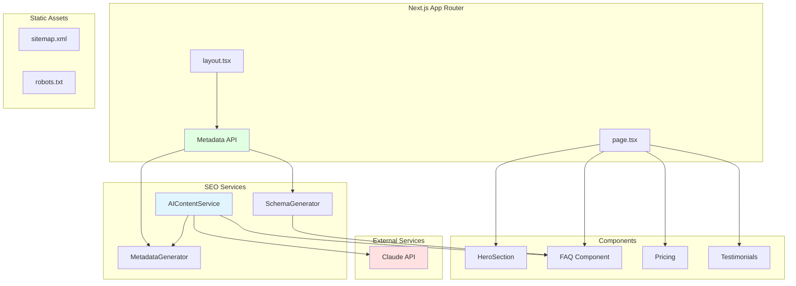
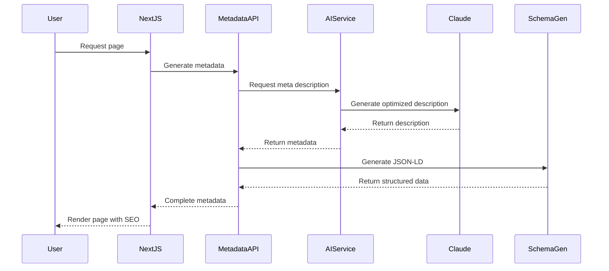
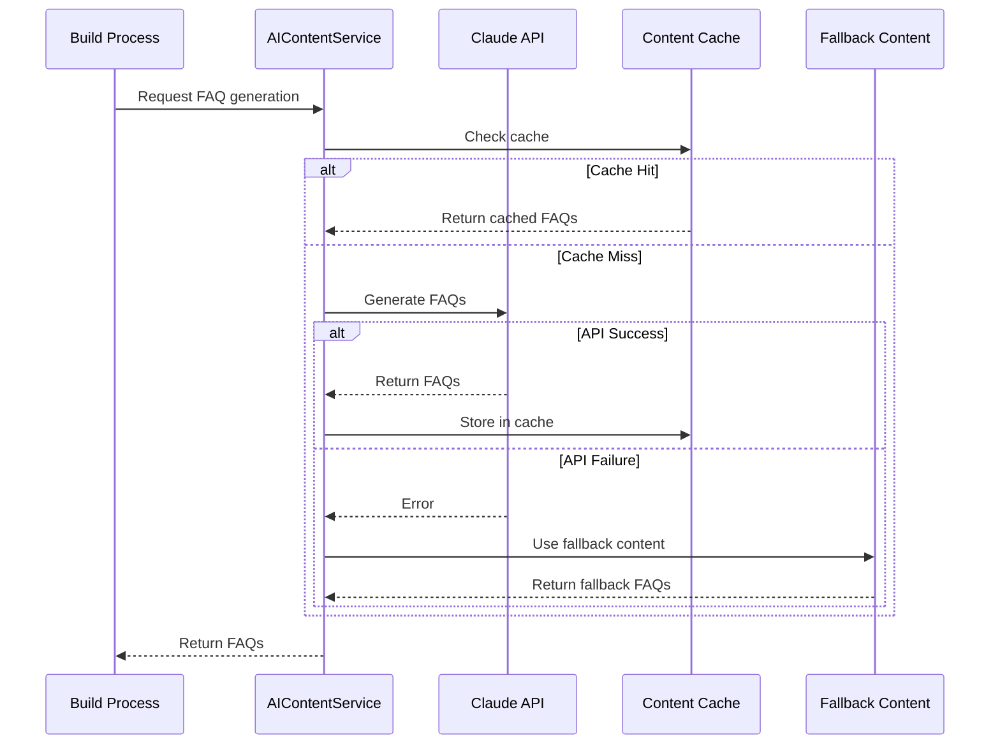
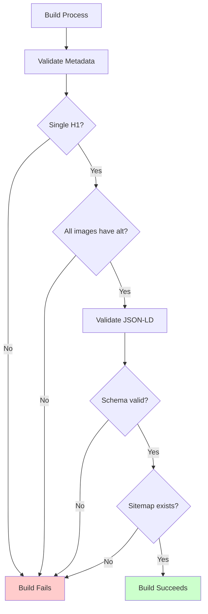

# Design Document: SEO Engagement Optimizer

## Overview

The SEO Engagement Optimizer enhances the Trimio landing page to achieve top Google rankings for target keywords ("salon management software", "salon booking system", "salon appointment app") while maximizing conversion rates. This feature implements comprehensive technical SEO, structured data, Core Web Vitals optimization, AI-generated content, and conversion-focused enhancements.

The implementation leverages Next.js 14+ App Router capabilities including the Metadata API, Image optimization, and static generation features. The design integrates seamlessly with the existing component architecture in `src/components/blocks/` while preserving all current functionality and styling.

### Key Objectives

1. Achieve Google Lighthouse SEO score of 90+
2. Implement comprehensive meta tags and structured data for rich snippets
3. Optimize Core Web Vitals (LCP < 2.5s, FID < 100ms, CLS < 0.1)
4. Generate AI-powered SEO content using Claude API
5. Enhance conversion elements with clear CTAs and trust signals
6. Provide automated SEO validation and quality assurance

## Architecture

### System Components



### Data Flow



### Integration Points

1. **Next.js Metadata API**: Primary integration point for all meta tags and structured data
2. **Claude API**: External service for AI content generation (FAQs, meta descriptions)
3. **Next.js Image Component**: Built-in optimization for WebP conversion and lazy loading
4. **Existing Components**: Minimal modifications to preserve functionality while adding SEO attributes

## Components and Interfaces

### 1. MetadataGenerator Service

**Location**: `src/lib/seo/metadata-generator.ts`

**Purpose**: Centralized service for generating Next.js metadata objects with comprehensive SEO tags.

**Interface**:

```typescript
interface MetadataConfig {
  title: string;
  description: string;
  keywords?: string[];
  canonical?: string;
  ogImage?: string;
  twitterImage?: string;
}

interface GeneratedMetadata {
  title: string;
  description: string;
  keywords?: string;
  robots: {
    index: boolean;
    follow: boolean;
  };
  openGraph: {
    title: string;
    description: string;
    url: string;
    siteName: string;
    images: Array<{
      url: string;
      width: number;
      height: number;
      alt: string;
    }>;
    locale: string;
    type: string;
  };
  twitter: {
    card: string;
    title: string;
    description: string;
    images: string[];
  };
  alternates: {
    canonical: string;
  };
}

class MetadataGenerator {
  generatePageMetadata(config: MetadataConfig): GeneratedMetadata;
  generateHomeMetadata(): GeneratedMetadata;
}
```

**Key Responsibilities**:
- Generate complete metadata objects for Next.js Metadata API
- Ensure all required meta tags are present (title, description, OG, Twitter)
- Validate image URLs are absolute and meet dimension requirements
- Apply consistent branding and SEO best practices

### 2. SchemaGenerator Service

**Location**: `src/lib/seo/schema-generator.ts`

**Purpose**: Generate JSON-LD structured data for rich snippets in search results.

**Interface**:

```typescript
interface SoftwareApplicationSchema {
  "@context": "https://schema.org";
  "@type": "SoftwareApplication";
  name: string;
  applicationCategory: string;
  operatingSystem: string;
  offers: {
    "@type": "Offer";
    price: string;
    priceCurrency: string;
  };
  aggregateRating?: {
    "@type": "AggregateRating";
    ratingValue: string;
    reviewCount: string;
  };
}

interface FAQSchema {
  "@context": "https://schema.org";
  "@type": "FAQPage";
  mainEntity: Array<{
    "@type": "Question";
    name: string;
    acceptedAnswer: {
      "@type": "Answer";
      text: string;
    };
  }>;
}

class SchemaGenerator {
  generateSoftwareApplicationSchema(): SoftwareApplicationSchema;
  generateFAQSchema(faqs: Array<{ question: string; answer: string }>): FAQSchema;
  generateOrganizationSchema(): object;
}
```

**Key Responsibilities**:
- Generate valid JSON-LD structured data
- Support SoftwareApplication, FAQPage, and Organization schemas
- Ensure schema passes Google Rich Results Test
- Embed schemas in document head

### 3. AIContentService

**Location**: `src/lib/seo/ai-content-service.ts`

**Purpose**: Interface with Claude API to generate SEO-optimized content.

**Interface**:

```typescript
interface FAQItem {
  question: string;
  answer: string;
}

interface MetaDescriptionRequest {
  pageName: string;
  targetKeywords: string[];
  maxLength: number;
}

interface AIContentConfig {
  apiKey: string;
  model: string; // claude-sonnet-4-5
  maxTokens: number;
}

class AIContentService {
  constructor(config: AIContentConfig);
  
  async generateFAQs(
    topic: string,
    targetKeywords: string[],
    count: number
  ): Promise<FAQItem[]>;
  
  async generateMetaDescription(
    request: MetaDescriptionRequest
  ): Promise<string>;
  
  async generateAltText(
    imageName: string,
    context: string
  ): Promise<string>;
}
```

**Key Responsibilities**:
- Authenticate and communicate with Claude API
- Generate 8 FAQ question-answer pairs targeting long-tail keywords
- Generate meta descriptions under 155 characters with CTAs
- Generate descriptive alt text for images
- Handle API errors gracefully with fallbacks

### 4. Enhanced FAQ Component

**Location**: `src/components/blocks/faq.tsx`

**Modifications**: Add semantic HTML and structured data support.

**Interface**:

```typescript
interface FAQProps {
  faqs?: Array<{
    question: string;
    answer: string;
  }>;
  includeSchema?: boolean;
}

export function FAQ({ faqs, includeSchema = true }: FAQProps): JSX.Element;
```

**Key Changes**:
- Accept optional `faqs` prop for AI-generated content
- Render using semantic `<dl>`, `<dt>`, `<dd>` elements
- Optionally inject FAQPage JSON-LD schema
- Maintain existing accordion UI and styling

### 5. Image Optimization Wrapper

**Location**: `src/components/seo/optimized-image.tsx`

**Purpose**: Wrapper around Next.js Image component with SEO best practices.

**Interface**:

```typescript
interface OptimizedImageProps {
  src: string;
  alt: string;
  width: number;
  height: number;
  priority?: boolean;
  className?: string;
}

export function OptimizedImage(props: OptimizedImageProps): JSX.Element;
```

**Key Responsibilities**:
- Automatic WebP conversion via Next.js Image
- Lazy loading for below-the-fold images
- Explicit width/height to prevent CLS
- Priority loading for LCP images
- Descriptive alt text validation

### 6. SEO Validation Utility

**Location**: `src/lib/seo/validation.ts`

**Purpose**: Runtime validation of SEO requirements.

**Interface**:

```typescript
interface SEOValidationResult {
  passed: boolean;
  errors: string[];
  warnings: string[];
}

interface PageSEOCheck {
  hasTitle: boolean;
  hasDescription: boolean;
  hasCanonical: boolean;
  hasH1: boolean;
  h1Count: number;
  imagesWithoutAlt: number;
  structuredDataValid: boolean;
}

class SEOValidator {
  validateMetadata(metadata: GeneratedMetadata): SEOValidationResult;
  validatePageStructure(html: string): PageSEOCheck;
  validateStructuredData(jsonLD: object): SEOValidationResult;
}
```

**Key Responsibilities**:
- Validate metadata completeness
- Check for single H1 per page
- Verify all images have alt text
- Validate JSON-LD syntax
- Generate actionable error messages

## Data Models

### FAQ Data Model

```typescript
interface FAQ {
  id: string;
  question: string;
  answer: string;
  keywords: string[];
  createdAt: Date;
  source: 'manual' | 'ai-generated';
}
```

### Metadata Configuration Model

```typescript
interface PageMetadata {
  slug: string;
  title: string;
  description: string;
  keywords: string[];
  ogImage: string;
  canonical: string;
  lastModified: Date;
}
```

### Structured Data Models

```typescript
interface SoftwareApplication {
  name: string;
  applicationCategory: 'BusinessApplication';
  operatingSystem: 'Web, iOS, Android';
  offers: {
    price: string;
    priceCurrency: 'INR';
    priceValidUntil?: string;
  };
  aggregateRating: {
    ratingValue: number;
    reviewCount: number;
    bestRating: number;
  };
  description: string;
  url: string;
}
```


## Correctness Properties

*A property is a characteristic or behavior that should hold true across all valid executions of a system—essentially, a formal statement about what the system should do. Properties serve as the bridge between human-readable specifications and machine-verifiable correctness guarantees.*

### Property 1: Metadata Completeness

*For any* page metadata generation, the output SHALL include all required meta tags: title with primary keyword, description (150-155 chars with keywords), canonical URL, robots directives (index, follow), viewport tag, complete Open Graph tags (title, description, image, url, type), and complete Twitter Card tags (card, title, description, image), with no duplicate tags.

**Validates: Requirements 1.1, 1.2, 1.3, 1.4, 1.5, 1.6, 1.7, 9.1, 9.5**

### Property 2: Social Media Image URLs

*For any* Open Graph or Twitter Card image specification, the URL SHALL be absolute (not relative) and the image dimensions SHALL be at least 1200x630 pixels.

**Validates: Requirements 1.8**

### Property 3: Structured Data Completeness

*For any* JSON-LD schema generation, the output SHALL be valid parseable JSON and SHALL include all required fields: SoftwareApplication schema with name, applicationCategory, operatingSystem, offers, and aggregateRating properties; FAQPage schema with mainEntity array containing properly structured Question and Answer objects.

**Validates: Requirements 2.1, 2.2, 2.3, 2.5, 9.3**

### Property 4: Image Optimization Attributes

*For any* image optimization operation, the output SHALL include explicit width and height attributes, WebP format conversion, appropriate lazy loading attribute (loading="lazy" for below-fold images), and a descriptive alt attribute containing relevant keywords.

**Validates: Requirements 3.1, 3.2, 3.3, 4.5, 4.6, 9.4**

### Property 5: Script Loading Optimization

*For any* non-critical JavaScript inclusion, the script tag SHALL include either defer or async attribute to prevent render blocking.

**Validates: Requirements 3.6**

### Property 6: Heading Hierarchy

*For any* page rendering, there SHALL be exactly one H1 element containing the primary keyword, and all H2 elements SHALL appear in hierarchical order after the H1.

**Validates: Requirements 4.1, 4.2, 9.2**

### Property 7: Semantic List Markup

*For any* list structure on the page, the markup SHALL use proper semantic elements (ul/ol with li children) rather than div elements.

**Validates: Requirements 4.4**

### Property 8: AI-Generated FAQ Constraints

*For any* FAQ generation request, the AI service SHALL return exactly 8 question-answer pairs, each answer SHALL be between 50-150 words, and both questions and answers SHALL contain the specified target keywords.

**Validates: Requirements 5.1, 5.3, 5.6**

### Property 9: FAQ Schema Synchronization

*For any* FAQ component rendering, if FAQs are present, the component SHALL generate corresponding FAQPage JSON-LD structured data with matching content.

**Validates: Requirements 5.5**

### Property 10: AI-Generated Meta Description Constraints

*For any* meta description generation request, the output SHALL be maximum 155 characters, SHALL incorporate the specified target keywords, and SHALL include a call-to-action phrase pattern (e.g., "Start", "Try", "Get", "Book", "Learn").

**Validates: Requirements 6.2, 6.3, 6.5**

### Property 11: Meta Description Uniqueness

*For any* set of different pages (features, pricing, about), the generated meta descriptions SHALL be unique (no duplicates).

**Validates: Requirements 6.4**

### Property 12: Sitemap Entry Structure

*For any* URL entry in the generated sitemap, the entry SHALL include loc, lastmod, changefreq, and priority elements, with homepage priority set to 1.0 and other pages to 0.8, and changefreq set to "weekly" for homepage and "monthly" for other pages.

**Validates: Requirements 8.2, 8.3, 8.4**


## Error Handling

### Claude API Failures

**Scenario**: Claude API is unavailable, rate-limited, or returns errors.

**Strategy**:
- Implement exponential backoff with 3 retry attempts
- Provide fallback content for FAQs and meta descriptions
- Log errors to monitoring service for investigation
- Gracefully degrade: use manually curated content as fallback
- Cache successful AI responses to reduce API calls

**Implementation**:
```typescript
async function generateWithFallback<T>(
  apiCall: () => Promise<T>,
  fallback: T,
  retries: number = 3
): Promise<T> {
  try {
    return await retryWithBackoff(apiCall, retries);
  } catch (error) {
    logger.error('AI service failed, using fallback', error);
    return fallback;
  }
}
```

### Invalid Structured Data

**Scenario**: Generated JSON-LD fails schema validation.

**Strategy**:
- Validate JSON-LD against schema.org types before embedding
- Use TypeScript types to ensure compile-time correctness
- Provide schema validation in development mode
- Log validation errors for debugging
- Omit invalid schema rather than serving broken markup

**Implementation**:
```typescript
function embedSchema(schema: object): string | null {
  try {
    const validated = validateSchema(schema);
    return JSON.stringify(validated);
  } catch (error) {
    logger.error('Invalid schema detected', error);
    return null; // Don't embed invalid schema
  }
}
```

### Image Optimization Failures

**Scenario**: Image conversion fails or source image is missing.

**Strategy**:
- Provide fallback to original image format if WebP conversion fails
- Use Next.js Image component error handling
- Validate image dimensions before optimization
- Serve placeholder image for missing sources
- Log optimization failures for investigation

**Implementation**:
```typescript
<Image
  src={src}
  alt={alt}
  width={width}
  height={height}
  onError={(e) => {
    logger.error('Image load failed', { src });
    e.currentTarget.src = '/placeholder.png';
  }}
/>
```

### Missing Environment Variables

**Scenario**: Required environment variables (API keys, URLs) are not configured.

**Strategy**:
- Validate environment variables at build time
- Provide clear error messages indicating missing variables
- Fail fast during build rather than at runtime
- Document all required environment variables in README

**Implementation**:
```typescript
const requiredEnvVars = [
  'ANTHROPIC_API_KEY',
  'NEXT_PUBLIC_SITE_URL',
] as const;

function validateEnv() {
  const missing = requiredEnvVars.filter(key => !process.env[key]);
  if (missing.length > 0) {
    throw new Error(`Missing required environment variables: ${missing.join(', ')}`);
  }
}
```

### Metadata Generation Errors

**Scenario**: Metadata generation produces invalid or incomplete data.

**Strategy**:
- Use TypeScript strict mode to catch type errors at compile time
- Validate metadata objects before returning
- Provide sensible defaults for optional fields
- Log warnings for missing recommended fields
- Ensure critical fields (title, description) always have values

**Implementation**:
```typescript
function ensureMetadataDefaults(metadata: Partial<MetadataConfig>): MetadataConfig {
  return {
    title: metadata.title || 'Trimio - The Only Salon Management Software',
    description: metadata.description || 'Streamline your salon operations...',
    keywords: metadata.keywords || ['salon management', 'booking system'],
    canonical: metadata.canonical || process.env.NEXT_PUBLIC_SITE_URL,
    ogImage: metadata.ogImage || '/og-image.png',
    twitterImage: metadata.twitterImage || '/twitter-image.png',
  };
}
```

## Testing Strategy

### Dual Testing Approach

This feature requires both unit tests and property-based tests for comprehensive coverage:

- **Unit tests**: Verify specific examples, edge cases, error conditions, and integration points
- **Property tests**: Verify universal properties across all inputs using randomized test data

Both testing approaches are complementary and necessary. Unit tests catch concrete bugs in specific scenarios, while property tests verify general correctness across a wide range of inputs.

### Property-Based Testing

**Library**: fast-check (already in package.json)

**Configuration**:
- Minimum 100 iterations per property test (due to randomization)
- Each property test references its design document property
- Tag format: `// Feature: seo-engagement-optimizer, Property {number}: {property_text}`

**Property Test Examples**:

```typescript
import fc from 'fast-check';

describe('Property 1: Metadata Completeness', () => {
  it('should include all required meta tags for any page config', () => {
    // Feature: seo-engagement-optimizer, Property 1: Metadata Completeness
    fc.assert(
      fc.property(
        fc.record({
          title: fc.string({ minLength: 10, maxLength: 60 }),
          description: fc.string({ minLength: 150, maxLength: 155 }),
          keywords: fc.array(fc.string(), { minLength: 1, maxLength: 10 }),
        }),
        (config) => {
          const metadata = metadataGenerator.generatePageMetadata(config);
          
          // Verify all required fields are present
          expect(metadata.title).toBeDefined();
          expect(metadata.description).toBeDefined();
          expect(metadata.robots).toEqual({ index: true, follow: true });
          expect(metadata.openGraph.title).toBeDefined();
          expect(metadata.openGraph.description).toBeDefined();
          expect(metadata.openGraph.image).toBeDefined();
          expect(metadata.twitter.card).toBeDefined();
          expect(metadata.alternates.canonical).toBeDefined();
          
          // Verify no duplicates (each key appears once)
          const keys = Object.keys(metadata);
          expect(keys.length).toBe(new Set(keys).size);
        }
      ),
      { numRuns: 100 }
    );
  });
});

describe('Property 8: AI-Generated FAQ Constraints', () => {
  it('should generate exactly 8 FAQs with proper word count and keywords', () => {
    // Feature: seo-engagement-optimizer, Property 8: AI-Generated FAQ Constraints
    fc.assert(
      fc.property(
        fc.record({
          topic: fc.string({ minLength: 5 }),
          keywords: fc.array(fc.string(), { minLength: 1, maxLength: 5 }),
        }),
        async (config) => {
          const faqs = await aiService.generateFAQs(
            config.topic,
            config.keywords,
            8
          );
          
          // Verify count
          expect(faqs).toHaveLength(8);
          
          // Verify word count for each answer
          faqs.forEach(faq => {
            const wordCount = faq.answer.split(/\s+/).length;
            expect(wordCount).toBeGreaterThanOrEqual(50);
            expect(wordCount).toBeLessThanOrEqual(150);
            
            // Verify keywords present
            const content = `${faq.question} ${faq.answer}`.toLowerCase();
            const hasKeyword = config.keywords.some(kw => 
              content.includes(kw.toLowerCase())
            );
            expect(hasKeyword).toBe(true);
          });
        }
      ),
      { numRuns: 100 }
    );
  });
});
```

### Unit Testing

**Library**: Vitest (already configured)

**Focus Areas**:
- Specific examples from requirements (CTAs, semantic HTML)
- Edge cases (empty strings, missing data, API errors)
- Integration points (Next.js Metadata API, Image component)
- Error handling and fallback behavior

**Unit Test Examples**:

```typescript
describe('FAQ Component', () => {
  it('should render using semantic HTML elements (dl, dt, dd)', () => {
    const faqs = [
      { question: 'Test Q1', answer: 'Test A1' },
      { question: 'Test Q2', answer: 'Test A2' },
    ];
    
    const { container } = render(<FAQ faqs={faqs} />);
    
    expect(container.querySelector('dl')).toBeInTheDocument();
    expect(container.querySelectorAll('dt')).toHaveLength(2);
    expect(container.querySelectorAll('dd')).toHaveLength(2);
  });
  
  it('should include FAQPage schema when includeSchema is true', () => {
    const faqs = [{ question: 'Test', answer: 'Answer' }];
    
    const { container } = render(<FAQ faqs={faqs} includeSchema={true} />);
    
    const script = container.querySelector('script[type="application/ld+json"]');
    expect(script).toBeInTheDocument();
    
    const schema = JSON.parse(script!.textContent!);
    expect(schema['@type']).toBe('FAQPage');
    expect(schema.mainEntity).toHaveLength(1);
  });
});

describe('Landing Page Structure', () => {
  it('should contain exactly one H1 with primary keyword', () => {
    const { container } = render(<Home />);
    
    const h1Elements = container.querySelectorAll('h1');
    expect(h1Elements).toHaveLength(1);
    expect(h1Elements[0].textContent).toContain('salon management software');
  });
  
  it('should display primary CTA "Start Free 14-Day Trial" in hero', () => {
    const { getByText } = render(<Home />);
    expect(getByText('Start Free 14-Day Trial')).toBeInTheDocument();
  });
  
  it('should include preconnect link for Google Fonts', () => {
    const { container } = render(<RootLayout><Home /></RootLayout>);
    
    const preconnect = container.querySelector(
      'link[rel="preconnect"][href*="fonts.googleapis.com"]'
    );
    expect(preconnect).toBeInTheDocument();
  });
});

describe('Error Handling', () => {
  it('should use fallback content when AI service fails', async () => {
    const mockAIService = {
      generateFAQs: vi.fn().mockRejectedValue(new Error('API Error')),
    };
    
    const faqs = await generateFAQsWithFallback(mockAIService, fallbackFAQs);
    
    expect(faqs).toEqual(fallbackFAQs);
    expect(mockAIService.generateFAQs).toHaveBeenCalled();
  });
  
  it('should omit invalid schema rather than embedding it', () => {
    const invalidSchema = { '@type': 'Invalid' }; // Missing required fields
    
    const result = embedSchema(invalidSchema);
    
    expect(result).toBeNull();
  });
});
```

### Integration Testing

**Focus**: End-to-end validation of SEO implementation

**Test Cases**:
1. Verify sitemap.xml is accessible at /sitemap.xml
2. Verify robots.txt is accessible at /robots.txt
3. Verify robots.txt contains sitemap directive
4. Verify all images on page have alt attributes
5. Verify JSON-LD scripts are present in document head
6. Verify meta tags are present in rendered HTML

**Example**:
```typescript
describe('SEO Integration', () => {
  it('should serve sitemap.xml at root', async () => {
    const response = await fetch('http://localhost:3000/sitemap.xml');
    expect(response.status).toBe(200);
    expect(response.headers.get('content-type')).toContain('xml');
  });
  
  it('should serve robots.txt with sitemap directive', async () => {
    const response = await fetch('http://localhost:3000/robots.txt');
    const text = await response.text();
    
    expect(text).toContain('User-agent: *');
    expect(text).toContain('Allow: /');
    expect(text).toContain('Sitemap:');
  });
});
```

### Test Coverage Goals

- **Unit Tests**: 80%+ code coverage
- **Property Tests**: All 12 correctness properties implemented
- **Integration Tests**: All critical SEO elements verified
- **Manual Testing**: Google Rich Results Test, Lighthouse audit

### Continuous Validation

**Development**:
- Run SEO validation on every build
- Warn about missing alt text or invalid schema
- Fail build if critical SEO requirements are not met

**Production**:
- Monitor Core Web Vitals via analytics
- Track SEO score changes over time
- Alert on broken structured data


## Implementation Approach

### Phase 1: Core SEO Infrastructure

**Goal**: Establish metadata generation and structured data foundation.

**Tasks**:
1. Create `MetadataGenerator` service in `src/lib/seo/metadata-generator.ts`
2. Create `SchemaGenerator` service in `src/lib/seo/schema-generator.ts`
3. Update `src/app/layout.tsx` to use Next.js Metadata API
4. Implement metadata generation for homepage
5. Add SoftwareApplication and Organization JSON-LD schemas
6. Create unit tests for metadata and schema generation

**Deliverables**:
- Functional metadata generation service
- Valid JSON-LD structured data
- Passing unit tests for core services

### Phase 2: AI Content Integration

**Goal**: Integrate Claude API for content generation.

**Tasks**:
1. Create `AIContentService` in `src/lib/seo/ai-content-service.ts`
2. Set up Anthropic SDK and API authentication
3. Implement FAQ generation with prompt engineering
4. Implement meta description generation
5. Add error handling and fallback content
6. Create property-based tests for AI service constraints

**Deliverables**:
- Working AI content generation service
- 8 AI-generated FAQs with proper constraints
- Fallback content for API failures
- Property tests validating AI output

### Phase 3: Image and Performance Optimization

**Goal**: Optimize images and Core Web Vitals.

**Tasks**:
1. Create `OptimizedImage` component in `src/components/seo/optimized-image.tsx`
2. Convert all image references to use Next.js Image component
3. Add WebP conversion configuration to `next.config.ts`
4. Implement lazy loading for below-fold images
5. Add font preconnect and font-display: swap
6. Defer non-critical JavaScript
7. Measure and optimize LCP, FID, CLS

**Deliverables**:
- All images using OptimizedImage component
- WebP format for all images
- Improved Core Web Vitals metrics
- Passing image optimization tests

### Phase 4: Component Enhancements

**Goal**: Update existing components with SEO improvements.

**Tasks**:
1. Update FAQ component to use semantic HTML (dl, dt, dd)
2. Add FAQPage schema generation to FAQ component
3. Update hero section with optimized H1 and CTAs
4. Ensure proper heading hierarchy across all components
5. Add descriptive alt text to all images
6. Verify semantic HTML5 elements (section, article, nav, footer)

**Deliverables**:
- FAQ component with semantic markup and schema
- Proper heading hierarchy
- All images with descriptive alt text
- Semantic HTML throughout

### Phase 5: Sitemap and Robots

**Goal**: Implement sitemap and robots.txt.

**Tasks**:
1. Create `src/app/sitemap.ts` using Next.js sitemap generation
2. Create `src/app/robots.ts` using Next.js robots.txt generation
3. Configure sitemap with proper priorities and changefreq
4. Add sitemap directive to robots.txt
5. Test sitemap and robots.txt accessibility

**Deliverables**:
- Functional sitemap.xml at /sitemap.xml
- Functional robots.txt at /robots.txt
- Proper sitemap configuration

### Phase 6: Validation and Quality Assurance

**Goal**: Ensure all SEO requirements are met.

**Tasks**:
1. Create `SEOValidator` utility in `src/lib/seo/validation.ts`
2. Implement automated SEO checks
3. Run Google Rich Results Test on structured data
4. Run Google Lighthouse SEO audit
5. Verify all acceptance criteria are met
6. Fix any identified issues

**Deliverables**:
- SEO validation utility
- Lighthouse score 90+
- All structured data passing Rich Results Test
- All acceptance criteria verified

### File Structure

```
src/
├── app/
│   ├── layout.tsx                 # Updated with Metadata API
│   ├── page.tsx                   # Updated with semantic HTML
│   ├── sitemap.ts                 # New: Sitemap generation
│   └── robots.ts                  # New: Robots.txt generation
├── components/
│   ├── blocks/
│   │   ├── faq.tsx               # Updated: Semantic HTML + schema
│   │   ├── hero-section-1.tsx    # Updated: H1 optimization
│   │   ├── pricing.tsx           # Updated: Semantic markup
│   │   └── testimonials.tsx      # Updated: Schema markup
│   └── seo/
│       └── optimized-image.tsx   # New: Image optimization wrapper
├── lib/
│   └── seo/
│       ├── metadata-generator.ts  # New: Metadata generation
│       ├── schema-generator.ts    # New: JSON-LD generation
│       ├── ai-content-service.ts  # New: Claude API integration
│       └── validation.ts          # New: SEO validation
└── __tests__/
    └── seo/
        ├── metadata-generator.test.ts
        ├── schema-generator.test.ts
        ├── ai-content-service.test.ts
        └── validation.test.ts
```

### Environment Variables

Required environment variables for this feature:

```bash

# Site Configuration
NEXT_PUBLIC_SITE_URL=https://trimio.in
NEXT_PUBLIC_SITE_NAME=Trimio

# Optional: AI Service Configuration
AI_SERVICE_MAX_RETRIES=3
AI_SERVICE_TIMEOUT_MS=30000
```

### Next.js Configuration Updates

**next.config.ts**:

```typescript
import type { NextConfig } from 'next';

const nextConfig: NextConfig = {
  images: {
    formats: ['image/webp', 'image/avif'],
    deviceSizes: [640, 750, 828, 1080, 1200, 1920, 2048, 3840],
    imageSizes: [16, 32, 48, 64, 96, 128, 256, 384],
  },
  // Enable static optimization
  output: 'standalone',
};

export default nextConfig;
```

### Metadata API Implementation Example

**src/app/layout.tsx**:

```typescript
import type { Metadata } from 'next';
import { MetadataGenerator } from '@/lib/seo/metadata-generator';

const metadataGenerator = new MetadataGenerator();

export const metadata: Metadata = metadataGenerator.generateHomeMetadata();

export default function RootLayout({
  children,
}: {
  children: React.ReactNode;
}) {
  return (
    <html lang="en">
      <head>
        {/* Preconnect to external domains */}
        <link rel="preconnect" href="https://fonts.googleapis.com" />
        <link rel="preconnect" href="https://fonts.gstatic.com" crossOrigin="anonymous" />
      </head>
      <body>{children}</body>
    </html>
  );
}
```

### Sitemap Generation Example

**src/app/sitemap.ts**:

```typescript
import { MetadataRoute } from 'next';

export default function sitemap(): MetadataRoute.Sitemap {
  const baseUrl = process.env.NEXT_PUBLIC_SITE_URL || 'https://trimio.in';
  
  return [
    {
      url: baseUrl,
      lastModified: new Date(),
      changeFrequency: 'weekly',
      priority: 1.0,
    },
    {
      url: `${baseUrl}/#features`,
      lastModified: new Date(),
      changeFrequency: 'monthly',
      priority: 0.8,
    },
    {
      url: `${baseUrl}/#pricing`,
      lastModified: new Date(),
      changeFrequency: 'monthly',
      priority: 0.8,
    },
    {
      url: `${baseUrl}/#faq`,
      lastModified: new Date(),
      changeFrequency: 'monthly',
      priority: 0.8,
    },
  ];
}
```

### Robots.txt Generation Example

**src/app/robots.ts**:

```typescript
import { MetadataRoute } from 'next';

export default function robots(): MetadataRoute.Robots {
  const baseUrl = process.env.NEXT_PUBLIC_SITE_URL || 'https://trimio.in';
  
  return {
    rules: {
      userAgent: '*',
      allow: '/',
    },
    sitemap: `${baseUrl}/sitemap.xml`,
  };
}
```

### AI Content Generation Flow



### Performance Optimization Strategy

**Critical Rendering Path**:
1. Inline critical CSS for above-the-fold content
2. Preload LCP image (hero image)
3. Defer non-critical JavaScript
4. Use font-display: swap for web fonts
5. Minimize main thread work

**Image Loading Strategy**:
```typescript
// Hero image (LCP) - priority load
<OptimizedImage
  src="/hero-light.png"
  alt="Trimio dashboard interface"
  width={2700}
  height={1440}
  priority={true}
/>

// Below-fold images - lazy load
<OptimizedImage
  src="/feature-screenshot.png"
  alt="Appointment booking interface"
  width={1200}
  height={800}
  priority={false}
/>
```

**Font Loading Strategy**:
```typescript
// In layout.tsx
const geistSans = Geist({
  variable: "--font-geist-sans",
  subsets: ["latin"],
  display: 'swap', // Prevent invisible text
  preload: true,
});
```

### SEO Validation Workflow



### Monitoring and Analytics

**Metrics to Track**:
1. Google Search Console impressions and clicks
2. Core Web Vitals (LCP, FID, CLS) via Google Analytics
3. Lighthouse SEO score over time
4. Structured data errors in Search Console
5. Conversion rates from organic search traffic

**Alerting**:
- Alert if Lighthouse SEO score drops below 90
- Alert if Core Web Vitals exceed thresholds
- Alert if structured data validation fails
- Alert if sitemap becomes inaccessible

## Dependencies

### External Services

1. **Anthropic Claude API**
   - Purpose: AI content generation (FAQs, meta descriptions)
   - Model: claude-sonnet-4-5
   - Rate limits: Consider caching to minimize API calls
   - Fallback: Manual curated content

2. **Google Search Console**
   - Purpose: Monitor search performance and structured data
   - Setup: Verify site ownership and submit sitemap

3. **Google Analytics**
   - Purpose: Track Core Web Vitals and user behavior
   - Setup: Install GA4 tracking code

### NPM Packages

All required packages are already in package.json:
- `next`: 16.1.6 (Metadata API, Image optimization, sitemap/robots)
- `react`: 19.2.3
- `fast-check`: 4.6.0 (Property-based testing)
- `vitest`: 4.1.3 (Unit testing)

Additional package needed:
- `@anthropic-ai/sdk`: For Claude API integration

```bash
npm install @anthropic-ai/sdk
```

### Browser Compatibility

Target browsers:
- Chrome/Edge: Last 2 versions
- Firefox: Last 2 versions
- Safari: Last 2 versions
- Mobile browsers: iOS Safari 14+, Chrome Android 90+

All SEO features (meta tags, structured data, semantic HTML) are universally supported.

## Security Considerations

### API Key Management

- Store Anthropic API key in environment variables (never commit to repo)
- Use server-side only (never expose to client)
- Rotate API keys periodically
- Monitor API usage for anomalies

### Content Security Policy

Update CSP headers to allow:
- Google Fonts domains (fonts.googleapis.com, fonts.gstatic.com)
- Analytics domains (if using GA4)
- Structured data inline scripts

### Input Validation

- Validate all user-provided content before generating metadata
- Sanitize AI-generated content before rendering
- Escape special characters in JSON-LD
- Validate image URLs before optimization

## Accessibility Considerations

While this feature focuses on SEO, accessibility improvements benefit both:

1. **Alt Text**: Descriptive alt text helps screen readers and SEO
2. **Semantic HTML**: Proper heading hierarchy aids navigation
3. **Keyboard Navigation**: Ensure all CTAs are keyboard accessible
4. **Focus Management**: Maintain logical focus order
5. **ARIA Labels**: Add where semantic HTML is insufficient

These accessibility improvements also contribute to SEO rankings, as Google considers accessibility in its algorithms.

## Future Enhancements

### Phase 2 Considerations

1. **Multi-language SEO**: Add hreflang tags for international markets
2. **Blog Integration**: Add blog with SEO-optimized articles
3. **Video SEO**: Add VideoObject schema for demo videos
4. **Local SEO**: Add LocalBusiness schema for physical locations
5. **Review Schema**: Add Review and AggregateRating schemas
6. **Breadcrumb Schema**: Add BreadcrumbList for navigation
7. **A/B Testing**: Test different meta descriptions and CTAs
8. **Dynamic Content**: Generate personalized meta descriptions based on user location

### Continuous Improvement

1. Monitor keyword rankings and adjust content strategy
2. Analyze search queries in Search Console and create content for high-volume queries
3. Update FAQs based on actual customer questions
4. Optimize images further based on Core Web Vitals data
5. Experiment with different structured data types

